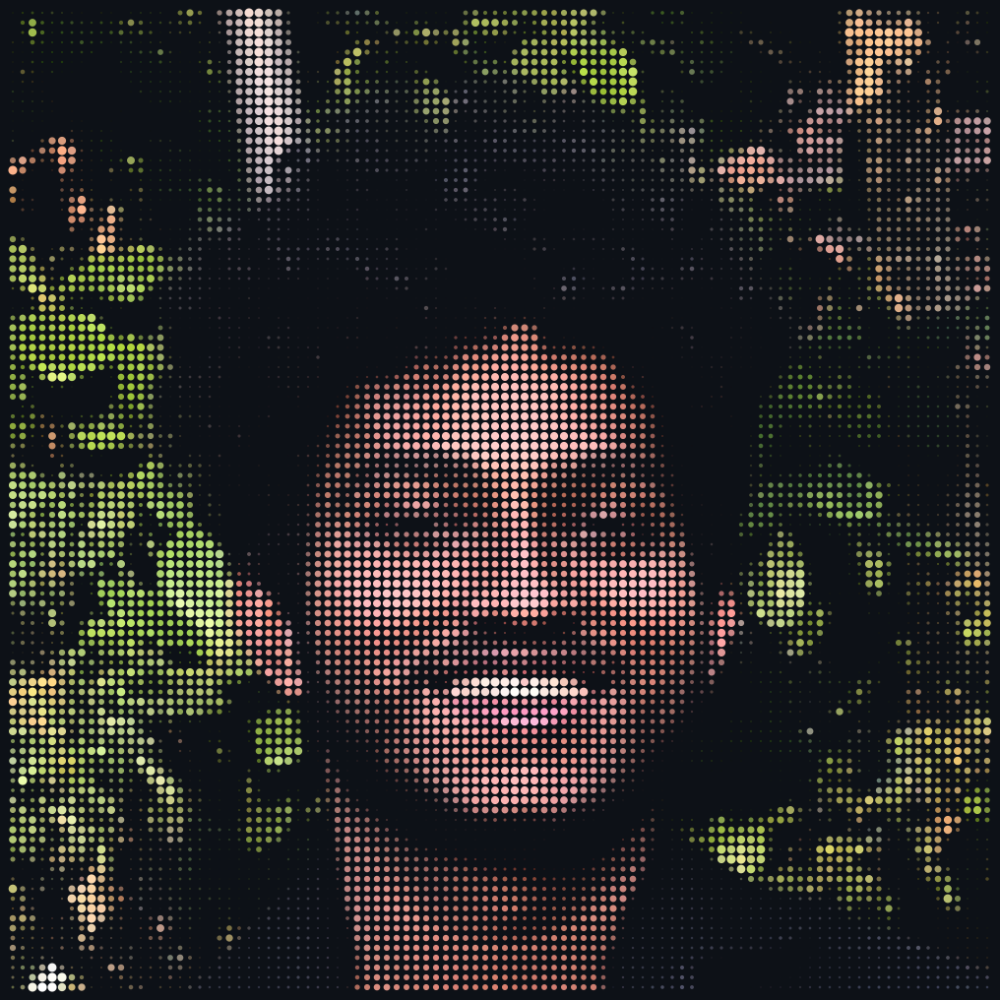
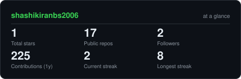
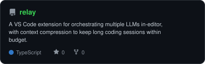
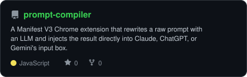
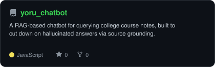
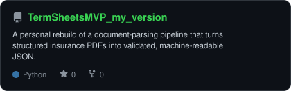

<div align="center">

<!-- PORTRAIT - generated by scripts/dotify.py from your source photo.
     Keep the SVG local so it loads reliably from the repository. -->



<br>

<!-- NAME / TAGLINE - animated typing -->

<a href="https://github.com/shashikiranbs2006">
  
</a>

<br>

<!-- SOCIALS -->

<a href="https://www.linkedin.com/in/shashikiran-bs/">
  
</a>
<a href="mailto:shashikiranbs238@gmail.com">
  
</a>
<a href="https://my-portfolio-black-seven-97.vercel.app/">
  
</a>


</div>

---

## `~/` whoami

```console
$ cat about.txt
```

Hi, I'm **Shashikiran** — a 3rd-year CSE (AI/ML) student at BMS Institute of Technology & Management, Bengaluru.

* Currently interning at **KlarDataLabs** (Zurich, remote) as an **Agentic AI & LLM Engineer Intern**
* Building document-processing systems with **AWS Bedrock** and the **Strands Agents SDK**
* Treasurer & Lead Organiser at **Coding Club BMSIT** — organised **NIRMAAN 2026**, a national hackathon
* Currently working through **NeetCode 150** and getting deeper into DSA
* Portfolio: **[my-portfolio-black-seven-97.vercel.app](https://my-portfolio-black-seven-97.vercel.app/)**

<br>

<div align="center">

## `~/` toolbox


</div>

---

<div align="center">

## `~/` skill radar

<table>
<tr>
<td width="50%" align="center" valign="middle">

<!-- Self-rated radar - edit assets/skills.json and run scripts/radar.py -->

<picture>
  <source media="(prefers-color-scheme: dark)" srcset="assets/radar-dark.svg">
  <source media="(prefers-color-scheme: light)" srcset="assets/radar-light.svg">
  
</picture>

</td>
<td width="50%" align="center" valign="middle">

<!-- Live radar generated from language usage across repositories -->

<picture>
  <source media="(prefers-color-scheme: dark)" srcset="assets/radar-langs-dark.svg">
  <source media="(prefers-color-scheme: light)" srcset="assets/radar-langs-light.svg">
  
</picture>

</td>
</tr>
</table>

</div>

---

<div align="center">

## `~/` contribution calendar

<!-- 3D isometric contribution calendar.
     Generated by .github/workflows/metrics.yml -->


<br><br>

<!-- Contribution snake.
     Generated by .github/workflows/snake.yml -->

<picture>
  <source
    media="(prefers-color-scheme: dark)"
    srcset="https://raw.githubusercontent.com/shashikiranbs2006/shashikiranbs2006/output/snake-dark.svg">
  <source
    media="(prefers-color-scheme: light)"
    srcset="https://raw.githubusercontent.com/shashikiranbs2006/shashikiranbs2006/output/snake.svg">
  
</picture>

</div>

---

<div align="center">

## `~/` the numbers

<!-- Generated locally by scripts/cards.py.
     This avoids relying on shared public statistics instances. -->

<picture>
  <source media="(prefers-color-scheme: dark)" srcset="assets/card-stats-dark.svg">
  <source media="(prefers-color-scheme: light)" srcset="assets/card-stats-light.svg">
  
</picture>

<br>

<!-- Generated by the Metrics workflow -->


<br><br>

<!-- Generated by the Metrics workflow -->


</div>

---

<div align="center">

## `~/` selected work

<!-- Project cards generated by scripts/cards.py from assets/projects.json -->

<table>
<tr>

<td width="50%">
  <a href="https://github.com/shashikiranbs2006/relay">
    <picture>
      <source media="(prefers-color-scheme: dark)" srcset="assets/card-relay-dark.svg">
      <source media="(prefers-color-scheme: light)" srcset="assets/card-relay-light.svg">
      
    </picture>
  </a>
</td>

<td width="50%">
  <a href="https://github.com/shashikiranbs2006/prompt-compiler">
    <picture>
      <source media="(prefers-color-scheme: dark)" srcset="assets/card-prompt-compiler-dark.svg">
      <source media="(prefers-color-scheme: light)" srcset="assets/card-prompt-compiler-light.svg">
      
    </picture>
  </a>
</td>

</tr>

<tr>

<td width="50%">
  <a href="https://github.com/shashikiranbs2006/yoru_chatbot">
    <picture>
      <source media="(prefers-color-scheme: dark)" srcset="assets/card-yoru_chatbot-dark.svg">
      <source media="(prefers-color-scheme: light)" srcset="assets/card-yoru_chatbot-light.svg">
      
    </picture>
  </a>
</td>

<td width="50%">
  <a href="https://github.com/shashikiranbs2006/TermSheetsMVP_my_version">
    <picture>
      <source media="(prefers-color-scheme: dark)" srcset="assets/card-TermSheetsMVP_my_version-dark.svg">
      <source media="(prefers-color-scheme: light)" srcset="assets/card-TermSheetsMVP_my_version-light.svg">
      
    </picture>
  </a>
</td>

</tr>
</table>

<sub>

| project                                                                                       | stack                                                                                                 |
| --------------------------------------------------------------------------------------------- | ----------------------------------------------------------------------------------------------------- |
| **[relay](https://github.com/shashikiranbs2006/relay)**                                       | `TypeScript` — multi-model AI coding extension for VS Code                                            |
| **[prompt-compiler](https://github.com/shashikiranbs2006/prompt-compiler)**                   | `JavaScript` — Chrome extension that rewrites prompts and injects them into Claude / ChatGPT / Gemini |
| **[yoru_chatbot](https://github.com/shashikiranbs2006/yoru_chatbot)**                         | `JavaScript` — RAG chatbot over college notes                                                         |
| **[TermSheetsMVP_my_version](https://github.com/shashikiranbs2006/TermSheetsMVP_my_version)** | `Python` — insurance PDF → validated JSON parsing pipeline                                            |

</sub>

</div>

---

<div align="center">

<sub>
Built with a mix of code, caffeine, and too many GitHub Actions.
</sub>

<br>

<sub>
01100011 01101111 01100100 01100101 &nbsp; 00110001 00110000 00110001
</sub>

</div>
